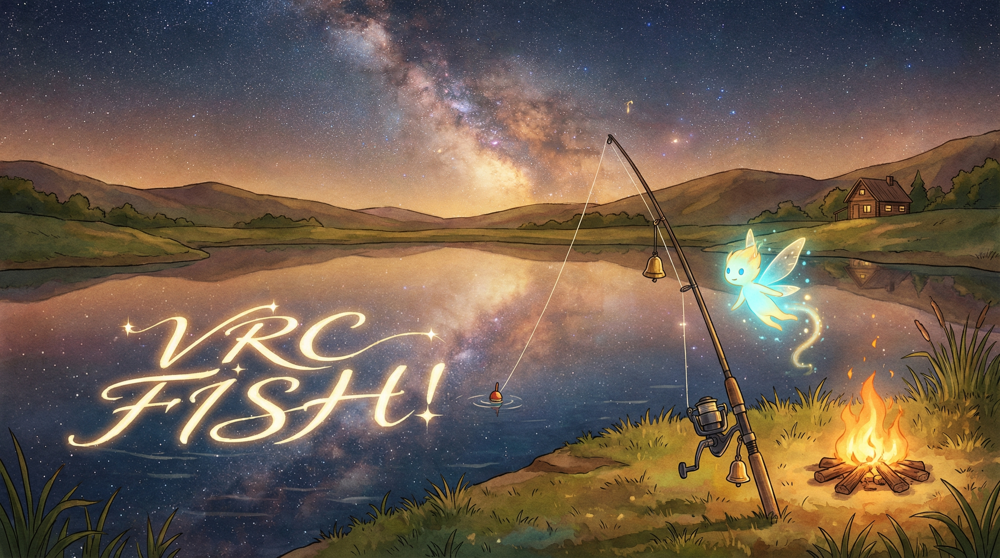

  

  <h1>VRChat FISHǃ 自动钓鱼（辅助向）</h1>
  
Windows · C++ · OpenCV 4.6.0 · 模板匹配 · 物理模型 + MPC（可选 ML）

  

    <a href="README.en.md">English</a> · <b>中文</b>
  

  

    
    
    
    
  

> 说明：本项目最初是我为一位**运动功能障碍**的朋友编写的辅助工具，公开出来主要用于**学习交流/研究**（授权以 `LICENSE` 为准）。  
> 钓鱼是一件放松的事情，希望大家**以休闲为主**，并遵守 VRChat 及相关服务的规则/条款。

  
<b>目录</b>

- [项目简介](#项目简介)
- [演示视频](#演示视频)
- [功能特性](#功能特性)
- [适用世界](#适用世界)
- [快速开始](#快速开始)
- [构建](#构建)
- [配置说明](#配置说明)
- [日志与调试](#日志与调试)
- [实验脚本（可选）](#实验脚本可选)
- [目录结构](#目录结构)
- [免责声明](#免责声明)
- [License](#license)

---

## 项目简介

一个运行在 Windows 上的小工具：通过 OpenCV 对 VRChat 钓鱼界面的关键元素做模板匹配/颜色检测，并用“鼠标左键按住/松开”的方式辅助完成钓鱼小游戏的操作。

本仓库当前主要关注 **VRChat 世界 FISHǃ** 的钓鱼逻辑与相关参数/实验脚本。

## 演示视频

- 3×速：[`auto-fishing-3x.mp4`](auto-fishing-3x.mp4)

## 功能特性

- 自动循环：抛竿 → 等咬钩 → 点击咬钩 → 控制小游戏 → 结算/清理 → 下一轮
- 识别方式：
  - `matchTemplate`：咬钩感叹号、小游戏轨道、鱼图标、滑块模板（必要时）
  - 颜色检测：在轨道竖条上按亮度阈值提取玩家滑块上下边界（优先）
- 控制方式：根据滑块物理模型做 MPC（Model Predictive Control）决策，驱动 <kbd>鼠标左键</kbd> 按住/松开
- 记录与扩展：支持 `ml_mode`（录制数据 / 推理）以及日志分析、物理参数拟合脚本

## 适用世界

本项目主要适配 VRChat 世界 **FISHǃ**：
- World URL: https://vrchat.com/home/world/wrld_ae001ea3-ed05-42f0-adf2-3d47efd10a77
- World ID: `wrld_ae001ea3-ed05-42f0-adf2-3d47efd10a77`

模板截图、阈值与 ROI 等参数均基于该世界的钓鱼 UI。若世界更新导致 UI 变化，需要重新截取 `Resource-VRChat/` 下的模板并调整 `config.ini`。

## 快速开始

1. 在 VRChat 的显示/图形设置中将分辨率设置为 `1280×960`（与本仓库模板默认分辨率一致）。
2. 进入 VRChat 世界 **FISHǃ**，确保你已经在钓鱼点位，并让钓鱼 UI 保持可见（不要被其他窗口遮挡）。
3. 抛竿后，找一个合适的站位/视角，确保“上钩提醒”（感叹号下半部分的圆点）和小游戏的“滑块轨道”完整出现在屏幕内（不出屏/不遮挡）。
4. 按需调整 `config.ini`（尤其是窗口定位、分辨率、阈值与清理流程参数），然后运行 `vrc-fish.exe`。若 `is_pause=1`，可用 <kbd>Tab</kbd> 暂停/继续。

提示：
- 工程默认启用 `RequireAdministrator`，运行时可能需要管理员权限。
- 程序会尝试将 VRChat 客户区强制调整到 `target_width` × `target_height`（由 `force_resolution` 控制），以稳定模板匹配效果。
- 程序会从当前工作目录读取 `config.ini`，并从 `resource_dir`（默认 `Resource-VRChat/`）加载模板；建议在仓库根目录运行，或将 `config.ini` / `Resource-VRChat/` 拷贝到可执行文件同目录。

## 构建

1. 用 Visual Studio 打开 `vrc-fish.sln`
2. 选择 `x64` + `Release`（或 `Debug`）
3. 编译生成 `vrc-fish.exe`

依赖说明：
- OpenCV 4.6.0：工程按 `include/` + `lib/` 组织，并在可执行文件同目录放置 `opencv_*460.dll`（仓库根目录已包含对应 DLL）。
- VS Code 用户可以参考 `.vscode/tasks.json` 中的 `Build Release` 任务（路径可能需要按你的 VS 安装位置调整）。
- 运行时请确保可执行文件能找到 `config.ini` 与 `Resource-VRChat/`（可通过设置工作目录为仓库根目录，或拷贝运行所需文件到输出目录）。

## 配置说明

配置文件：`config.ini`

| 分组 | Key | 说明 |
|---|---|---|
| `common` | `is_pause` | 是否启用 <kbd>Tab</kbd> 暂停/继续（1=开启） |
| `vrchat_fish` | `window_class` / `window_title_contains` | 定位 VRChat 窗口（默认 `UnityWndClass` + 标题含 `VRChat`） |
| `vrchat_fish` | `force_resolution` / `target_width` / `target_height` | 是否强制调整 VRChat 客户区分辨率 |
| `vrchat_fish` | `capture_interval_ms` / `control_interval_ms` | 截图轮询与控制循环间隔 |
| `vrchat_fish` | `bite_threshold` / `minigame_threshold` / `fish_icon_threshold` / `slider_threshold` | 关键模板匹配阈值（0~1） |
| `vrchat_fish` | `cleanup_*` / `cleanup_reel_key` | 结算/清理到下一轮：等待、点击次数、收杆按键等 |
| `vrchat_fish` | `ml_mode` / `ml_record_csv` / `ml_weights_file` | 0=自动控制，1=录制数据，2=ML 推理 |
| `vrchat_fish` | `debug` / `debug_pic` / `debug_dir` / `vr_log_file` | 调试输出、截图保存与 CSV 日志 |

资源模板：
- 默认目录：`Resource-VRChat/`
- 可通过 `tpl_*` 配置项改名或替换模板文件（咬钩感叹号、轨道、鱼图标、玩家滑块等）

## 日志与调试

- `debug=1`：在控制台输出识别分数、状态切换与控制信息
- `debug_pic=1`：在 `debug_dir` 下保存关键帧截图（用于排查模板失配/ROI 错位等问题）
- `vr_log_file`：追加写入 CSV/文本日志（仓库内自带 `data/logs/` 示例）

## 实验脚本（可选）

脚本目录：`scripts/`

- `fit_physics.py`：从调试日志拟合滑块物理参数（`bb_gravity` / `bb_thrust` / `bb_drag`）
- `analyze_log.py` / `analyze_oscillation.py`：分析 MPC 冲顶/震荡、跳变等行为
- `train_bc.py`：行为克隆训练（需要 `numpy`），输出 `data/ml_weights.txt` 供 `ml_mode=2` 推理使用

> 这些脚本主要用于研究/调参，不影响基础使用。

## 目录结构

- `vrc-fish.cpp`：主程序（窗口捕获、模板匹配/颜色检测、状态机、控制策略、清理流程等）
- `config.ini`：配置
- `Resource-VRChat/`：FISHǃ 世界钓鱼 UI 的模板图片
- `data/`：日志与样例数据、ML 权重文件
- `scripts/`：日志分析 / 参数拟合 / 行为克隆训练等

## 免责声明

- 本项目非 VRChat 官方作品，与 VRChat 没有任何关联。
- 请遵守 VRChat 及相关服务的规则/条款；使用本项目带来的一切后果由使用者自行承担。
- 该代码按“学习与研究”目的公开，不提供任何保证；请勿用于破坏他人体验、违反服务条款或其他不当场景。
- 上述“使用建议/免责声明”仅为提醒，不构成对 `LICENSE`（GPL-3.0）条款的额外限制。

## License

本项目源码采用 GPL-3.0，详见 `LICENSE`。仓库中包含的第三方组件/资源可能适用不同许可或权利声明，详见 `THIRD_PARTY_NOTICES.md`。
